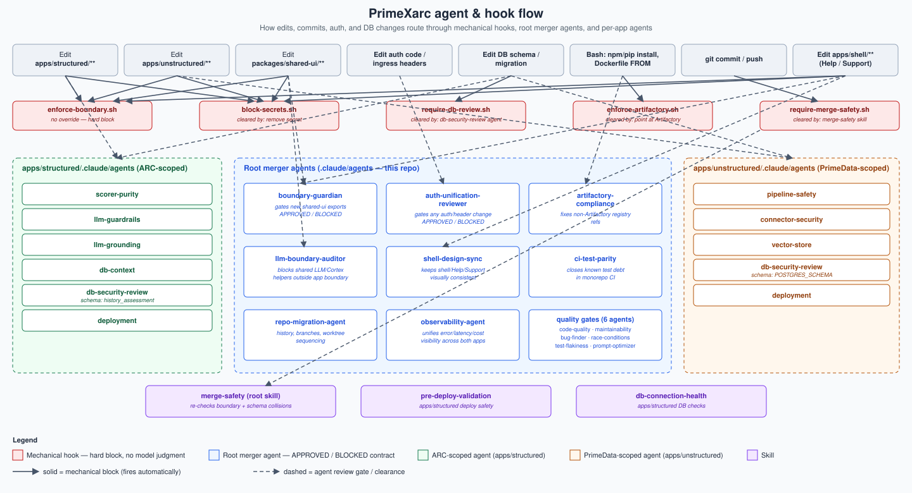

# Agent map

How Claude Code's agents, hooks, and skills are wired across PrimeXarc.
Three tiers: repo-root merger agents (this repo's `.claude/agents/`), per-app agents that migrated in with ARC and PrimeData, and the mechanical hooks/skills that gate work regardless of which agent is "in charge."

See CLAUDE.md §8-9 for the rules these enforce; this doc is the map of who enforces what.

## 1. Tiering

```
PrimeXarc/
├── .claude/                        ← MERGER-LEVEL agents (cross-app concerns)
│   ├── agents/*.md                 (14 agents, listed in §2)
│   ├── hooks/*.sh                  (5 PreToolUse hooks, listed in §3)
│   └── skills/merge-safety/        (pre-push gate)
├── apps/structured/.claude/        ← ARC's own agents, authority stays scoped here
│   ├── agents/{scorer-purity, llm-guardrails, llm-grounding,
│   │           db-context, db-security-review, deployment}.md
│   └── skills/{db-connection-health, pre-deploy-validation}/
├── apps/unstructured/.claude/      ← PrimeData's own agents, authority stays scoped here
│   └── agents/{pipeline-safety, connector-security, vector-store,
│               db-security-review, deployment}.md
└── apps/shell/                     ← no agents of its own; governed by
                                        shell-design-sync + boundary-guardian (root)
```

Rule of thumb: if a task touches only one app's internals, its own `.claude/agents/` has final say (CLAUDE.md §3.2-3.3: "ARC's Prime Directives survive unchanged," "PrimeData's pipeline model survives unchanged"). If a task crosses the shell/packages boundary, touches auth, or proposes sharing code, a root-level merger agent has to sign off *in addition to* the app-local one.

## 2. Flow diagram



Rendered SVG at `docs/agent-map.svg` — open it directly (browser, VS Code preview, GitHub file view) if it doesn't render inline in your Markdown viewer. Solid arrows are mechanical hook blocks (fire automatically, no model judgment); dashed arrows are agent review gates (`APPROVED`/`BLOCKED` contracts).

## 3. Mechanical hooks (deterministic, not model judgment)

| Hook | Fires on | Blocks | Cleared by |
|---|---|---|---|
| `enforce-boundary.sh` | `Edit`, `Write` | Import path crossing `apps/structured/**` ↔ `apps/unstructured/**` | Never — hard block, no override |
| `enforce-artifactory.sh` | `Bash`, `Edit`, `Write` | `npm install`/`pip install` against public registries; non-Artifactory Dockerfile `FROM` | Point at Artifactory (see `artifactory-compliance`) |
| `require-db-review.sh` | `Edit`, `Write` on DB migration/schema files | Further edits until DB review has run | `db-security-review` agent run (per-app), 30-min TTL in `.claude/.last-db-review` |
| `require-merge-safety.sh` | `Bash` (`git commit`/`git push`) | Commit/push | `merge-safety` skill run, 30-min TTL in `.claude/.last-validated` |
| `block-secrets.sh` | `Edit`, `Write` | Hardcoded secrets/keys/passwords | Remove the secret |

## 4. Root-level merger agents — trigger table

| Agent | Loads when | Contract |
|---|---|---|
| `boundary-guardian` | Adding an export to `packages/shared-ui`, or any "let's just share this one function" proposal | `APPROVED — <notes>` / `BLOCKED — <reason>`, no middle ground |
| `auth-unification-reviewer` | Any change to auth code in either app, shell session bootstrap, ingress/NetworkPolicy manifests, or code reading `X-USER-EMAIL`/`X-USER-NAME`/`X-UPN` | `APPROVED — <notes>` / `BLOCKED — <reason>`; never approves header-trust without verified network isolation; never approves deleting MSAL before Bouncer is verified end-to-end |
| `artifactory-compliance` | `enforce-artifactory.sh` blocks something, or migrating a Dockerfile/package manifest | Fixes registry config |
| `llm-boundary-auditor` | New shared LLM helper, shared prompt template, or Cortex client proposed outside an app's own boundary | Cross-product containment review, distinct from each app's own LLM agents |
| `shell-design-sync` | Editing `apps/shell`, or reconciling Help/Support content between apps | Keeps shell/Help/Support visually and structurally consistent |
| `ci-test-parity` | Setting up monorepo CI, wiring either app's test suite in | Closes known test debt (§7 of CLAUDE.md), doesn't let it become PrimeXarc's problem |
| `repo-migration-agent` | Migrating a source repo in, setting up PR flow, sequencing multi-week work | Owns history preservation, branch/worktree conventions |
| `observability-agent` | Wiring monitoring into `apps/structured` for the first time, adding a Cortex call, "can we see errors/cost across both apps" | Unifies observability given PrimeData already has Faro+OTel and ARC has none |
| `code-quality`, `maintainability`, `bug-finder`, `race-conditions`, `test-flakiness`, `prompt-optimizer` | General-purpose gates: after non-trivial logic, before merge, when a prompt regresses | Apply repo-wide; each app may layer its own override on top |

## 5. Per-app agents (unchanged authority, scoped)

**`apps/structured/.claude/agents/`** (ARC / structured, migrated with the app):
`scorer-purity` (no I/O/LLM calls in `core/scorer.py`), `llm-guardrails` + `llm-grounding` (single LLM boundary, additive-only `advise()`), `db-context` + `db-security-review` (fixed `history_assessment` schema, source-DB credential non-persistence), `deployment`.

**`apps/unstructured/.claude/agents/`** (PrimeData / unstructured, migrated with the app):
`pipeline-safety` (Airflow DAG / chunk-embed-index model), `connector-security`, `vector-store` (vector-store-as-metadata-source-of-truth), `db-security-review` (parameterized `POSTGRES_SCHEMA`), `deployment`.

These two `db-security-review` agents are deliberately separate, not shared — CLAUDE.md §3.4 requires distinct schemas and distinct review gates so neither app's default can leak into the other's.

## 6. Skills

| Skill | Runs | Checks |
|---|---|---|
| `merge-safety` (root) | Before any commit/push; auto-fires via `require-merge-safety.sh` | Boundary violations + dual-schema collisions — the merger-specific checks on top of each app's own pre-deploy skill |
| `pre-deploy-validation` (`apps/structured`) | ARC deploys | ARC-specific deploy safety, still governs internally post-migration |
| `db-connection-health` (`apps/structured`) | ARC DB work | Connection/health checks scoped to ARC |

## 7. Reading this map

- **Adding a feature inside one app** → that app's own agents apply, plus repo-wide quality agents (`code-quality`, `bug-finder`, etc.). Root merger agents generally don't load.
- **Touching `packages/shared-ui` or proposing to share anything** → `boundary-guardian` (and `llm-boundary-auditor` if it's LLM-adjacent) must sign off before merge, on top of `enforce-boundary.sh`'s mechanical block.
- **Touching auth anywhere** → `auth-unification-reviewer` is required, full stop (CLAUDE.md §4).
- **Touching either app's DB schema** → that app's own `db-security-review` agent, gated mechanically by `require-db-review.sh`.
- **Any commit/push** → `merge-safety` skill, gated mechanically by `require-merge-safety.sh`.
